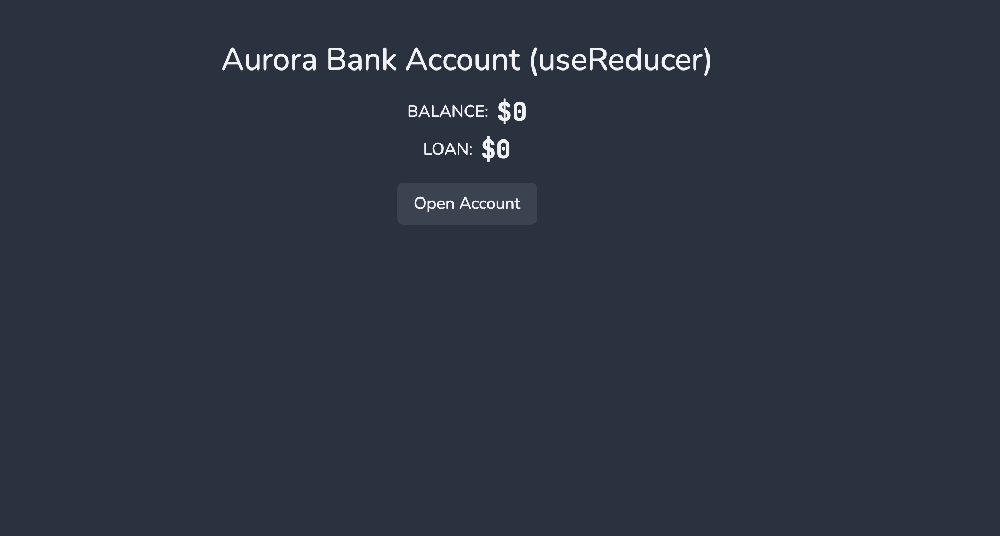
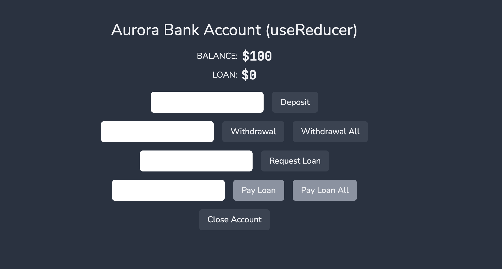

# Aurora Banking 🏦

Demo version: [Click Me 😃!](https://672cd7b5ce724e9865ba06c1--aurora-banking-usereducer.netlify.app/)

Hello Guys! 😊

This is the simple project; however, I used advanced state management concept called useReducer hooks. I chose `useReducer` over `useState` because this application is:

1. Complex state logic
2. Multiple values and actions
3. Centralized state management
4. Predictable state transition
5. Improved testability
6. Scalability

## Instructions:

1. Let's implement a simple bank account! It's similar to the example that I used as an analogy to explain how useReducer works, but it's simplified (we're not using account numbers here)

2. Use a reducer to model the following state transitions: openAccount, deposit, withdraw, requestLoan, payLoan, closeAccount. Use the `initialState` below to get started.

3. All operations (expect for opening account) can only be performed if isActive is true. If it's not, just return the original state object. You can check this right at the beginning of the reducer

4. When the account is opened, isActive is set to true. There is also a minimum deposit amount of 100 to open an account (which means that the balance will start at 100)

5. Customer can only request a loan if there is no loan yet. If that condition is met, the requested amount will be registered in the 'loan' state, and it will be added to the balance. If the condition is not met, just return the current state

6. When the customer pays the loan, the opposite happens: the money is taken from the balance, and the 'loan' will get back to 0. This can lead to negative balances, but that's no problem, because the customer can't close their account now (see next point)

7. Customer can only close an account if there is no loan, AND if the balance is zero. If this condition is not met, just return the state. If the condition is met, the account is deactivated and all money is withdrawn. The account basically gets back to the initial state

